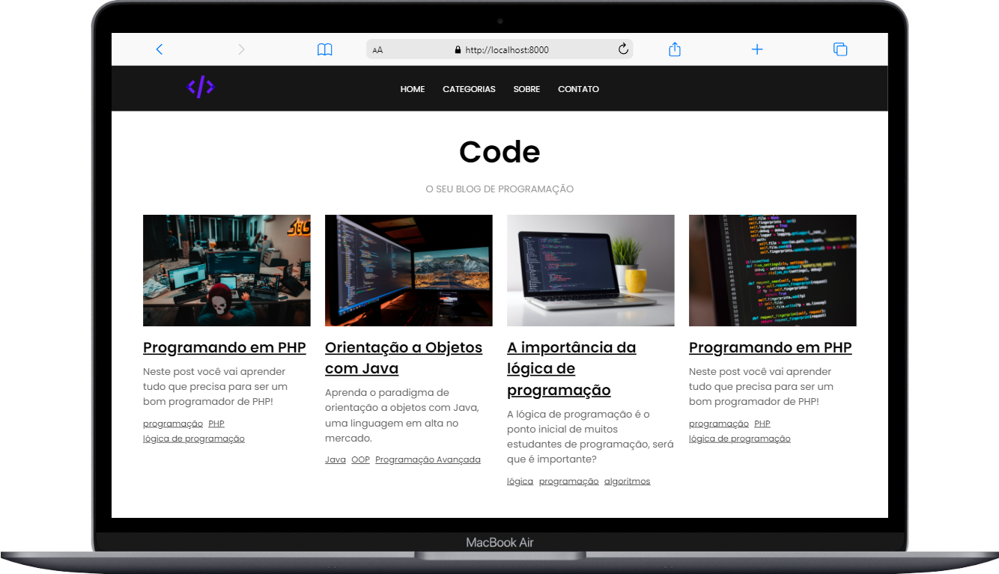

## <h1>✨CODE✨</h1>
<h3>Desenvolvir este projeto com intuito de me aperfeiçoar meu php,que comecei a estudar a 2 semanas. então decidir fazer um projeto que conecta front-end com back-end e desenvolvi o blog chamado CODE,um blog de mentira que simula uma conexão entre back-end e front-end, o certo seria ter um banco de dados (SQL,MYSQL,etc...) porém não comecei a estudar nada sobre, então tive que desenvolver um "banco de dados" falso para que eu pudesse simular.
 
 
 
 

 
 
 

## 💻 Linguagens Utilizadas:

* PHP
* HTML